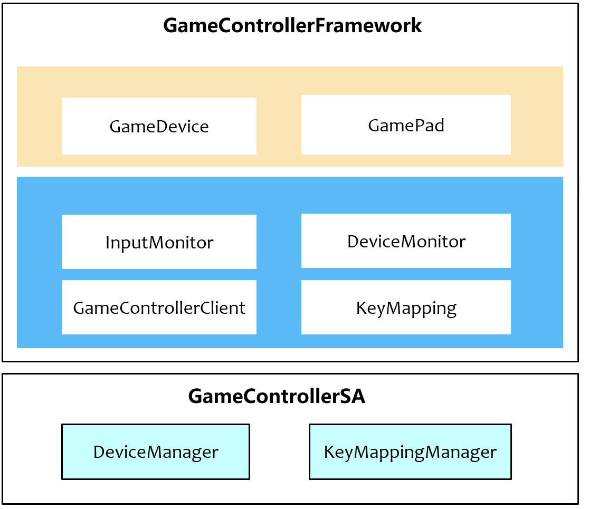

# GameController Framework

## Introduction

The GameController is designed to provide game developers with the capability to integrate game peripherals and
to offer terminal device manufacturers the ability to convert input into touch controls.
It consists of two components: the game_controller_framework and the game_controller_service.
Currently, the component in use is the game_controller_framework.

- The game_controller_framework serves as the framework layer for GameController. Its primary functions include:
    - Providing API interfaces for game developers to implement the monitoring of the connection and disconnection
      of game peripherals, as well as the input monitoring of these peripherals.
    - Enabling terminal device manufacturers to offer gamers the ability to play games using peripherals such as
      keyboards and mouse, without requiring game developers to adapt their software, through the input-to-touch
      conversion feature.
    - Offering InnerApi to terminal device manufacturers for configuring information about
      game peripherals and the input-to-touch conversion settings.
- The game_controller_service is the CoreService layer of the GameController. Its primary functions include:
    - Saving game peripheral information to the configuration file `device_config.json`.
    - Saving the list of supported games for input-to-touch conversion to the configuration
      file `game_support_key_mapping.json`.
    - Saving the default input-to-touch conversion configuration for games to the configuration
      file `default_key_mapping.json` and custom configuration to the configuration file `custom_key_mapping.json`.
    - Identifying the categories of game peripherals.
    - Query the default and custom input-to-touch mapping information for the game from default_key_mapping.json and
      custom_key_mapping.json.

System Architecture Diagram:


- GameController(Framework) is the game_controller_framework component.
- GameController(SA) is the game_controller_framework component.

Core Modules of GameControllerFramework:


- **Window**

1) Registering with the window requires intercepting and listening to input events from game peripherals.
    - If the developer calls the API to listen to input events from game peripherals,
      the intercepted input event callbacks will be notified to the game.
    - If the game is configured to support input-to-touch conversion, the intercepted input events from
      game peripherals will be used for the input-to-touch feature.

2) Monitor window size changes for use in input-to-touch feature.

- **MultiModalInput**

1) Connect to multi-mode-input and monitor the online and offline events of gaming peripherals.

    - If the developer calls the API to monitor the online and offline events of gaming peripherals, the online and
      offline event callbacks of the gaming peripherals will be notified to the game.
    - If the game is configured to support input-to-touch conversion, the corresponding input-to-touch conversion
      configuration for the gaming peripheral type will be loaded.

2) Upon receiving the gaming equipment online, identify the category of the gaming peripherals.

- **KeyMapping**

1) Read the configuration from game_support_key_mapping.json to determine whether to enable the input-to-touch
   functionality.
2) Read the corresponding game peripheral type's touch conversion configuration from the game_controller_service.
3) Based on the input events and categories of gaming peripherals, determine whether to send a notification for
   configuring the input-to-touch configuration.
    - When the keyboard inputs Q, W, or P, it indicates the need to open the input-to-touch configuration
      page for the keyboard.
    - When the floating controller function key is clicked, it indicates the need to open the input-to-touch
      configuration
      configuration interface for the floating controller.

4) Based on the input-to-touch configuration, the input events of gaming peripherals (such as key events, mouse events,
   etc.)
   are converted into touchscreen events on the screen.

- **GameControllerService**

Provide the InnerAPI interface of the game_controller_service to terminal manufacturers for configuring game peripheral
information and input-to-touch conversion data.

- **BundleInfo**

Obtain information about the current application for input-to-touch conversion features.

## Launch of GameController(SA)

The GameController (SA) is not a persistent process; it will be initiated in the following two scenarios.

- Scene 1: When the gaming peripherals are connected, the GameControllerFramework will initiate the SA through samgr (
  System Service Management Component) to identify the device type.
- Scene 2: When the game service of the terminal device manufacturer configures game peripheral information or
  input-to-touch conversion configuration information through the InnerApi of the GameControllerFramework, the
  GameControllerFramework will invoke the SA via samgr (the system service management component).

The InnerAPI involving the SA that is being pulled up is located
in [gamecontroller_server_client.h](https://gitcode.com/openharmony-sig/game_game_controller_framework/blob/master/frameworks/native/gamecontroller_service/include/gamecontroller_server_client.h).

## The Framework of the window loads the GameControllerFramework

When the application starts, the framework layer of the window will load the GameControllerFramework's
libgamecontroller_event.z.so through dlopen, thereby enabling the automatic loading of the GameControllerFramework by
the application process upon startup.

## Directory Structure

```
/domain/game_controller/game_controller_framework
├── frameworks                     # Framework Code
│   ├── capi                       # NAPI Implementation Layer
│   │   ├── include
│   │   └── src
│   └── native                     # Native Code
│       ├── bundle_info            # Bundle Information Inquiry
│       │   ├── include
│       │   └── src
│       ├── gamecontroller_service # Connects to the SA of the GameController.
│       │   ├── include
│       │   └── src
│       ├── key_mapping            # Implementation of Key Mapping 
│       │   ├── include
│       │   └── src
│       ├── multi_modal_input      # Interconnection with multi-mode input 
│       │   ├── include
│       │   └── src
│       └── window                 # Interconnection window to game devices's input
│           ├── include
│           └── src  
├── interfaces                     # Interface Storage Directory 
│   └── kits                        
│       └── c                      # Directory for storing the NAPI interface.
├── test                           # Test Code
    └── mock                       # Mock Code
        └── gamecontroller_service
        └── multi_modal_input
    └── unittest                   # Unit test  
        └── multi_modal_input 
        └── window   
```

## Compile

1. [Download the master branch code of OpenHarmony](https://www.openharmony.cn/download/)
2. Execute compilation

```shell
./build.sh --product-name rk3568 --ccache --build-target game_controller_framework --build-variant root
```

3. The result path of compilation : /out/rk3568/game/game_controller_framework.

- libgamecontroller_client.z.so
- libgamecontroller_event.z.so
- libohgame_controller.z.so

## Reference Document

[Development Guide](https://gitcode.com/weixin_42784160/docs/blob/master/zh-cn/application-dev/game-controller/Readme-CN.md)

[API Documentation](https://gitcode.com/weixin_42784160/docs/blob/master/zh-cn/application-dev/reference/apis-game-controller-kit/Readme-CN.md)

[Development Guide for Terminal Device Manufacturers Based on GameController's InnerAPI](https://gitcode.com/openharmony-sig/game_game_controller_framework/wiki/Home.md)

[Input-To-Touch Feature](https://gitcode.com/openharmony-sig/game_game_controller_framework/wiki/Home.md)

## Related Repository

[Game Controller Service](https://gitcode.com/openharmony-sig/game_game_controller_service)

## Constraints

Programming language version: C++ 11 or later
