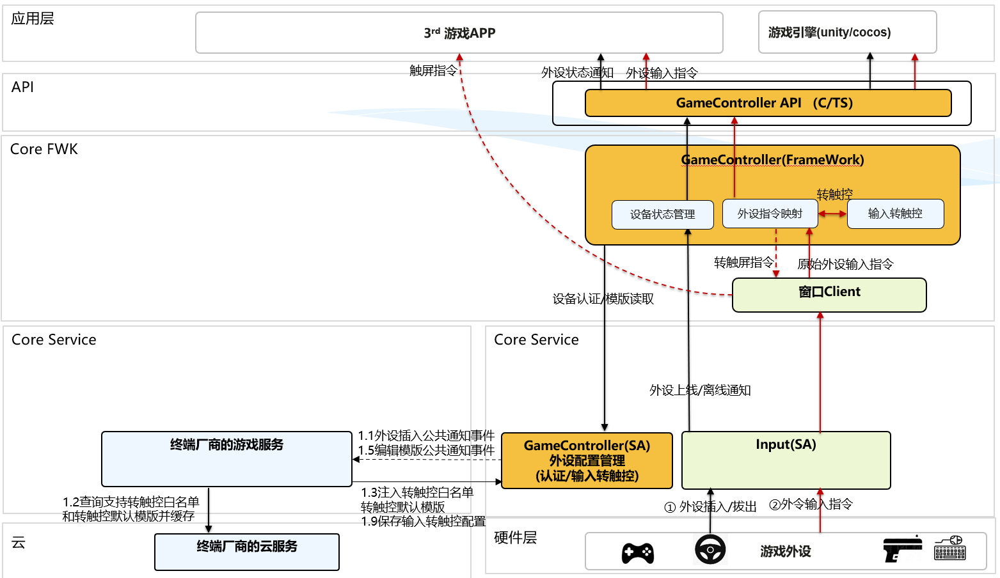

# 游戏控制器

## 简介

GameController给游戏开发者提供游戏外设接入能力的API，实现对游戏外设上下线监听和外设输入事件监听；
提供InnerAPI给终端设备厂商，让终端设备厂商可以实现对外设设备的识别信息的管理以及对输入转触控的配置管理。

- GameControllerFramework主要作用为：
    - 给游戏开发者提供API接口，实现对游戏外设的上下线的监听以及游戏外设的输入监听。
    - 通过输入转触控功能，在不需要游戏厂商适配的情况下，终端设备厂商可以给游戏玩家提供通过键盘、鼠标等游戏外设玩游戏的能力。
    - 给终端设备厂商提供InnerApi用于配置游戏外设的信息和输入转触控的信息。
- GameControllerSA主要作用为：
    - 实现游戏外设信息保存到配置文件device_config.json。
    - 实现支持输入转触控游戏的名单列表保存到配置文件game_support_key_mapping.json。
    - 实现游戏的默认转触控配置保存到配置文件default_key_mapping.json和自定义配置保存到配置文件custom_key_mapping.json。
    - 实现对游戏外设类别的识别。
    - 从default_key_mapping.json和custom_key_mapping.json查询游戏对应的默认和自定义的输入转触控配置信息。

系统架构图：


备注：当前只提供CAPI，未来会规划ArkTS接口。

### GameController内部核心模块：


### GameControllerFramework

- **GameDevice**

  给游戏开发者提供API，用于查询设备信息以及接收游戏外设的上下线事件通知。

- **GamePad**

  给游戏开发者提供API，用于接收游戏手柄的输入事件通知。

- **Window**

  对接窗口Framework，向窗口注册需要拦截监听的游戏外设的输入事件。收到事件后，进行如下处理：
    - 如果开发者调用API监听游戏外设的输入事件，则将拦截的游戏外设输入事件回调通知给游戏。
    - 如果游戏支持输入转触控，则将拦截的游戏外设输入事件用于输入转触控特性。

- **MultiModalInput**

  对接多摸输入，实现监听游戏外设的上线和下线事件。收到事件后，进行如下处理：
    - 如果开发者调用API监听游戏外设的上线和下线事件，则将游戏外设的上线和下线事件需要回调通知给游戏。
    - 如果游戏支持输入转触控，调用InnerAPI从GameControllerSA读取对应游戏外设类型的转触控配置。

- **KeyMapping**

  处理输入转触控的按键映射相关业务逻辑：
    - 从game_support_key_mapping.json读取配置判断是否需要启动输入转触控功能。
    - 基于游戏外设的输入事件和游戏外设类别，判断是否需要发送编辑输入转触控配置的通知。 当在键盘同时按下Q、W、P时，表示需要打开键盘的输入转触控的配置界面。
    - 基于输入转触控配置，将游戏外设的输入事件（按键事件、鼠标事件等）转为屏幕触屏事件。

- **SAClient**

  GameControllerSA的InnerAPI的定义。

### GameControllerSA

- **DeviceManager**
    - 对游戏外设进行设备类别识别，判断设备是键盘、还是游戏手柄等。
    - 其它系统SA向GameControllerSA同步游戏外设信息。其它系统SA为终端设备厂商开发的系统服务，例如系统架构图中的终端厂商的游戏服务。

- **KeyMappingManager**
    - 其它系统SA向GameControllerSA同步支持输入转触控特性的游戏列表。
    - 其它系统SA向GGameControllerSA同步输入转触控的默认配置及自定义配置。

## GameControllerSA的启动

GameControllerSA是一个独立进程，并且不是常驻进程，以下两种场景会启动SA。

- 场景一：在游戏外设连接上线时，GameControllerFramework会通过samgr(系统服务管理部件)拉起SA进行设备类型识别。
- 场景二：终端设备厂商的游戏服务通过GameControllerFramework的InnerApi配置游戏外设信息或输入转触控的配置信息时，
  GameControllerFramework会通过samgr(系统服务管理部件)拉起SA。

涉及存在拉起的SA的InnerAPI在[gamecontroller_server_client.h](https://gitcode.com/openharmony-sig/game_game_controller_framework/blob/master/frameworks/native/gamecontroller_service/include/gamecontroller_server_client.h)

## 窗口部件的Framework加载GameControllerFramework

应用启动的时候，窗口部件的Framework层会通过dlopen的方式加载GameControllerFramework下的libgamecontroller_event.z.so，
从而实现应用启动时应用进程自动加载GameControllerFramework。

## 目录

```
/domain/game/game_controller_framework
├── frameworks                     # 框架代码
│   ├── capi                       # capi的实现层
│   │   ├── include
│   │   └── src
│   └── native                     # 前后端组件对接层
│       ├── bundle_info            # 包信息
│       ├── sa_client              # 对接GameController的SA
│       ├── key_mapping            # 按键映射的实现
│       ├── multi_modal_input      # 对接多模输入实现设备的监听
│       └── window                 # 对接窗口实现外设输入的监听
├── service                        # 服务层代码
│   ├── common                     # 公共方法
│   ├── device_manager             # 设备管理
│   ├── event                      # 提供事件处理能力
│   ├── ipc                        # IPC接口的实现
│   └── key_mapping_manager        # 按键映射管理
├── interfaces                     # 接口存放目录 
│   └── kits                       # 对外接口存放目录 
│       └── c                      # napi接口存放目录
├── test                           # 测试代码
    └── mock                       # mock代码
    └── unittest                   # 单元测试  
    └── fuzztest                   # Fuzze测试 
```

## 编译

1. [下载OpenHarmony主干代码](https://www.openharmony.cn/download/)
2. 执行编译

```shell
./build.sh --product-name rk3568 --ccache --build-target game_controller_framework --build-variant root
```

3. 编译结果路径:/out/rk3568/game/game_controller_framework

- libgamecontroller_client.z.so
- libgamecontroller_service.z.so
- libgamecontroller_event.z.so
- libohgame_controller.z.so

## 参考文档

- [开发指南](https://gitcode.com/weixin_42784160/docs/blob/master/zh-cn/application-dev/game-controller/Readme-CN.md)

- [API文档](https://gitcode.com/weixin_42784160/docs/blob/master/zh-cn/application-dev/reference/apis-game-controller-kit/Readme-CN.md)

- [终端设备厂商基于GameController的InnerAPI的开发指南](https://gitcode.com/openharmony-sig/game_game_controller_framework/wiki/Home.md)

- [输入转触控特性](https://gitcode.com/openharmony-sig/game_game_controller_framework/wiki/Home.md)

## 相关仓

- [窗口](https://gitee.com/openharmony/window_window_manager/blob/master/README_zh.md)
- [多模输入](https://gitee.com/openharmony/multimodalinput_input/blob/master/README_zh.md)

## 约束

语言版本：C++11或以上