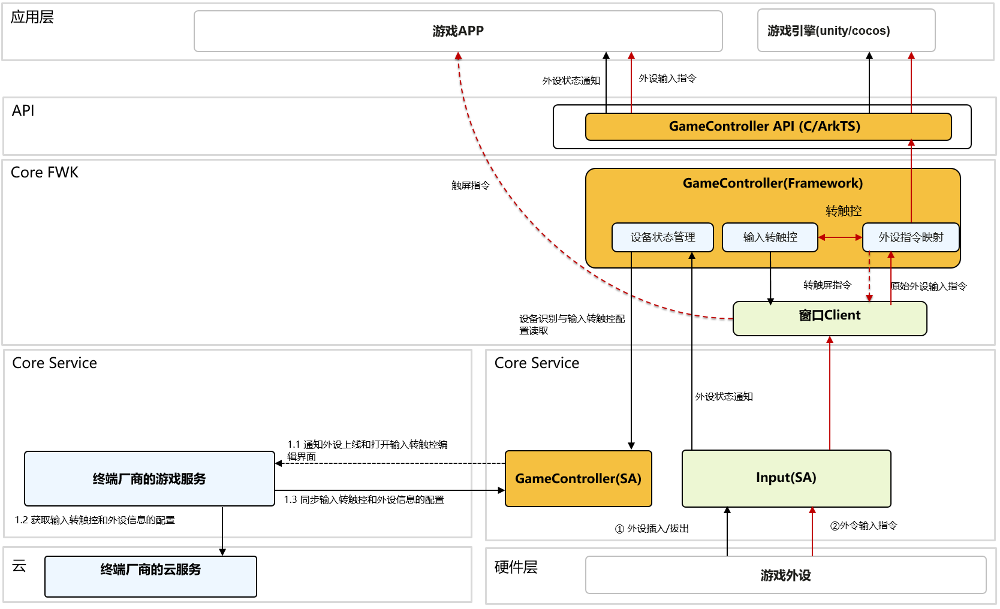

# 游戏控制器的Framework层

## 简介

GameController用于给游戏开发者提供游戏外设接入能力以及给终端设备厂商提供输入转触控能力。
它由game_controller_framework和game_controller_service两个部件构成。当前部件为game_controller_framework。

- game_controller_framework为GameController的framework层。主要作用为：
    - 给游戏开发者提供API接口，实现对游戏外设的上下线的监听以及游戏外设的输入监听。
    - 通过输入转触控功能，在不需要游戏厂商适配的情况下，终端设备厂商可以给游戏玩家提供通过键盘、鼠标等游戏外设玩游戏的能力。
    - 给终端设备厂商提供InnerApi用于配置游戏外设的信息和输入转触控的信息。
- game_controller_service为GameController的CoreService层。主要作用为：
    - 实现游戏外设信息保存到配置文件device_config.json。
    - 实现支持输入转触控游戏的名单列表保存到配置文件game_support_key_mapping.json。
    - 实现游戏的默认转触控模板保存到配置文件default_key_mapping.json和自定义模板保存到配置文件custom_key_mapping.json。
    - 实现对游戏外设类别的识别。
    - 从default_key_mapping.json和custom_key_mapping.json查询游戏对应的默认和自定义的输入转触控模板信息。

系统架构图：


GameControllerFramework内部核心模块：


- **Window**

1) 向窗口注册需要拦截监听的游戏外设的输入事件
    - 如果开发者调用API监听游戏外设的输入事件，则将拦截的游戏外设输入事件回调通知给游戏。
    - 如果游戏被配置支持输入转触控，则将拦截的游戏外设输入事件用于输入转触控特性。

2) 监听窗口大小变化，用于输入转触控特性。

- **MultiModalInput**

1) 对接多模输入，监听游戏外设的上线和下线事件。
    - 如果开发者调用API监听游戏外设的上线和下线事件，则将游戏外设的上线和下线事件回调通知给游戏。
    - 如果游戏被配置支持输入转触控，则加载对应游戏外设类型的输入转触控模板。
2) 收到游戏设备上线时，对游戏外设的设备类别进行识别。

- **KeyMapping**

1) 从game_support_key_mapping.json读取配置判断是否需要启动输入转触控功能。

2) 从game_controller_service读取对应游戏外设类型的转触控模板。

3) 基于游戏外设的输入事件和游戏外设类别，判断是否需要发送编辑输入转触控模板配置的通知。
    - 键盘输入Q、W、P时，表示需要打开键盘的输入转触控的模板配置界面。
    - 单击悬浮手柄功能键时，表示需要打开悬浮手柄的输入转触控的模板配置界面。

4) 基于输入转触控模板，将游戏外设的输入事件（按键事件、鼠标事件等）转为屏幕的触屏事件。

- **GameControllerService**

提供game_controller_service的InnerAPI接口给终端厂商配置游戏外设的信息和输入转触控的信息。

- **BundleInfo**

获取当前应用的信息，用于输入转触控特性。

## 目录

```
/domain/game_controller/game_controller_framework
├── frameworks                     # 框架代码
│   ├── capi                       # capi的实现层
│   │   ├── include
│   │   └── src
│   └── native                     # 前后端组件对接层
│       ├── bundle_info            # 包信息查询
│       │   ├── include
│       │   └── src
│       ├── gamecontroller_service # 对接GameController的SA
│       │   ├── include
│       │   └── src
│       ├── key_mapping            # 按键映射的实现
│       │   ├── include
│       │   └── src
│       ├── multi_modal_input      # 对接多模输入实现设备的监听
│       │   ├── include
│       │   └── src
│       └── window                 # 对接窗口实现外设输入的监听
│           ├── include
│           └── src  
├── interfaces                     # 接口存放目录 
│   └── kits                       # 对外接口存放目录 
│       └── c                      # napi接口存放目录
├── test                           # 测试代码
    └── mock                       # mock代码
        └── gamecontroller_service
        └── multi_modal_input
    └── unittest                   # 单元测试  
        └── multi_modal_input 
        └── window   
```

## 编译

1. [下载OpenHarmony主干代码](https://www.openharmony.cn/download/)
2. 执行编译

```shell
./build.sh --product-name rk3568 --ccache --build-target game_controller_framework --build-variant root
```

3. 编译结果路径：/out/rk3568/game/game_controller_framework

## 参考文档

- [开发指南](https://gitcode.com/weixin_42784160/docs/blob/master/zh-cn/application-dev/game-controller/Readme-CN.md)

- [API文档](https://gitcode.com/weixin_42784160/docs/blob/master/zh-cn/application-dev/reference/apis-game-controller-kit/Readme-CN.md)

- [输入转触控特性](https://gitcode.com/openharmony-sig/game_game_controller_framework/wiki/%E8%BE%93%E5%85%A5%E8%BD%AC%E8%A7%A6%E6%8E%A7%E7%89%B9%E6%80%A7.md)

## 相关仓

[Game Controller Service](https://gitcode.com/openharmony-sig/game_game_controller_service)

## 约束

语言版本：C++11或以上